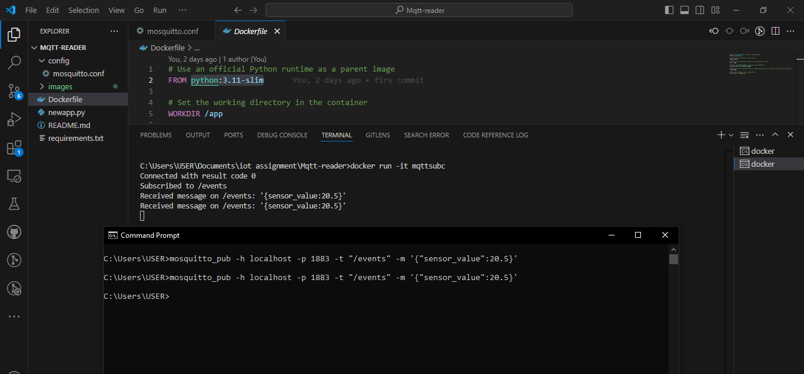

# Mqtt-reader

TASK
● Make a python program that connects to a Mosquitto MQTT broker, listens for messages
on the topic /events
● Start the Mosquitto MQTT broker from a docker container
● Dockerize your python application and start it.
● Manually publish a message to the topic.

Solution :

To solve this , first we hava created a container for mosquitto broker from eclipse-mosquitto docker image. After making broker image, then i create a python program which will subcribe my mqtt broker to a particular topic and fetch whatever data is coming to that topic on broker. 

After that, i have create a dockerfile to convert this python program into Docker image. For that i have used python:3.11-slim docker image to build. After succesfully build the image, i run that image to make a subscriber container, which will subscribe my mqtt-broker. 

For publish data, i used mqtt_pub command to publish data to my topic into mqtt-broker.

Let's make this solution into steps: 

pre-requisite : If you run running this on windows, ensure Docker desktop is installed and running into your machine. and Make sure you have mosquitto-clients available on your system so you can use commands like mosquitto_pub.

Step -1 :
Create a config folder, and in that folder create a file name > mosquitto.conf ,

Add these two below line into that file. 
allow_anonymous true
listener 1883 0.0.0.0

Note : We are allowing all anonymous user for just demo, if using in production, user need to authenticate them first to access broker. And we are allowing all ips as container need to be exposed into outside world.

Now create a mosquitto broker container from eclipse-mosquitto docker image. Run below commnad :

docker run -it --name dockerbroker -v ./config:/mosquitto/config/ eclipse-mosquitto:latest

Step-2 :
First we will create a python program which will subscribe my mqtt-broker. And test it with container broker . 

After succesfully testing in machine, now create container for this python program. For that you need to write a Dockerfile to first make image of python program. 

After creating Dockerfile, need to run below commnad :

docker build -t mqttsubc .

This command will make image with name of "mqttsubc". After that make a container from this image feom below command :

docker run -it mqttsubc

Great !!, you both broker & subscriber container are running, even you can check into Docker Desktop. 

Now open your command prompt and run below commnad to publish data to broker and you will se publish data where your subscriber container is running.

mosquitto_pub -h localhost -p 1883 -t "/events" -m '{"sensor_value":20.5}'

That's it...
